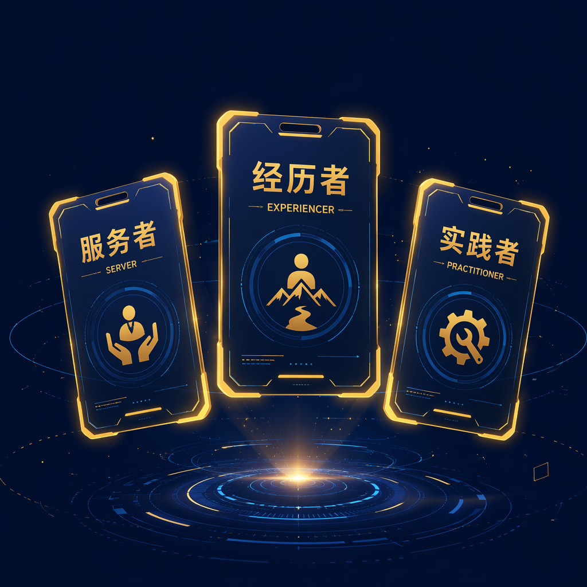
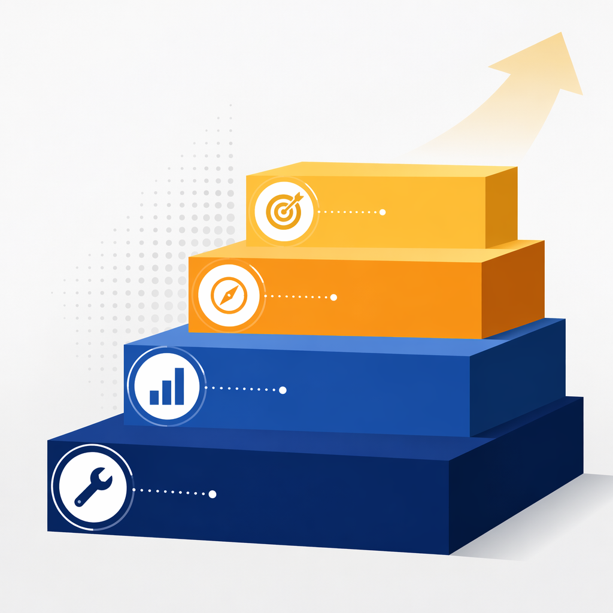
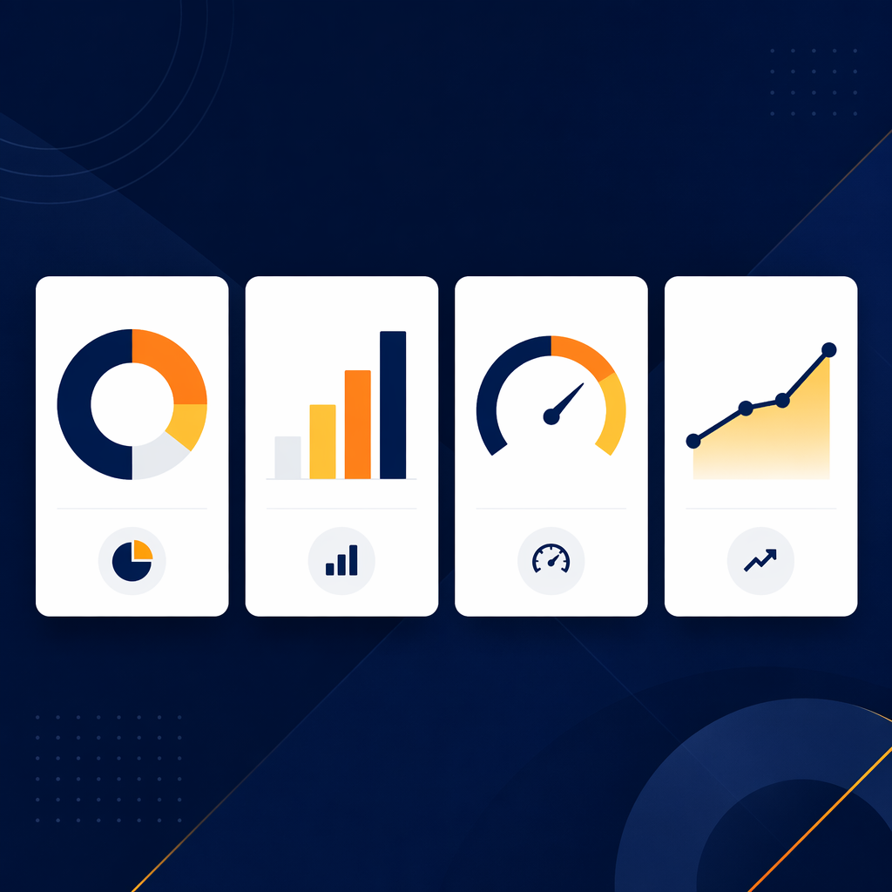
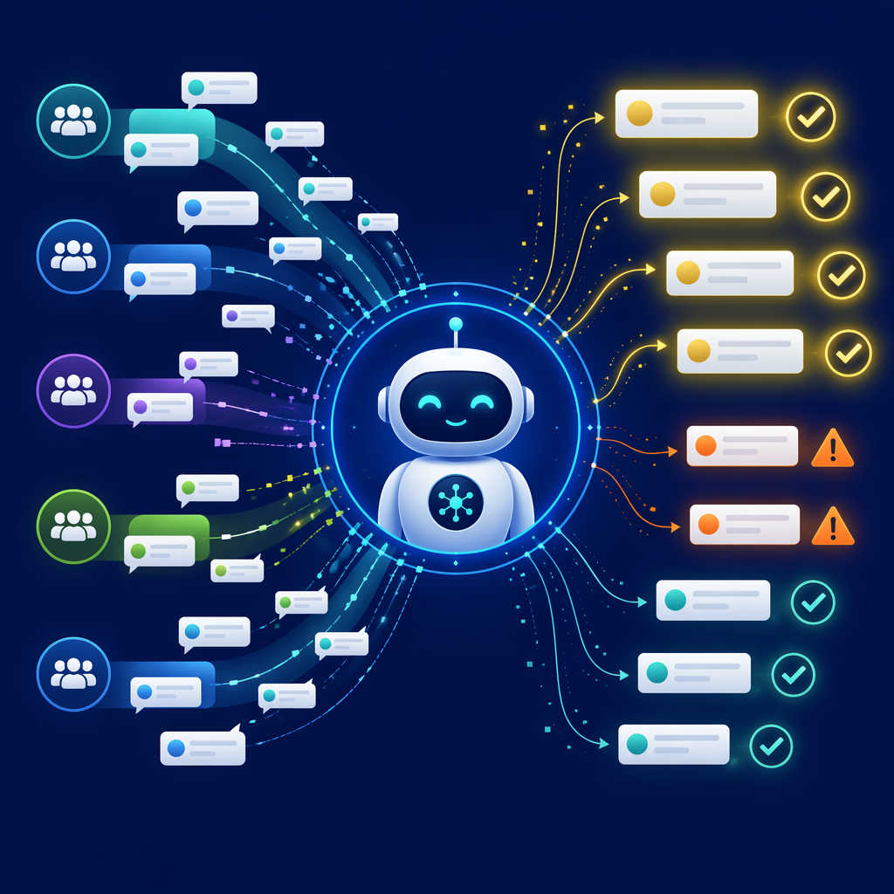
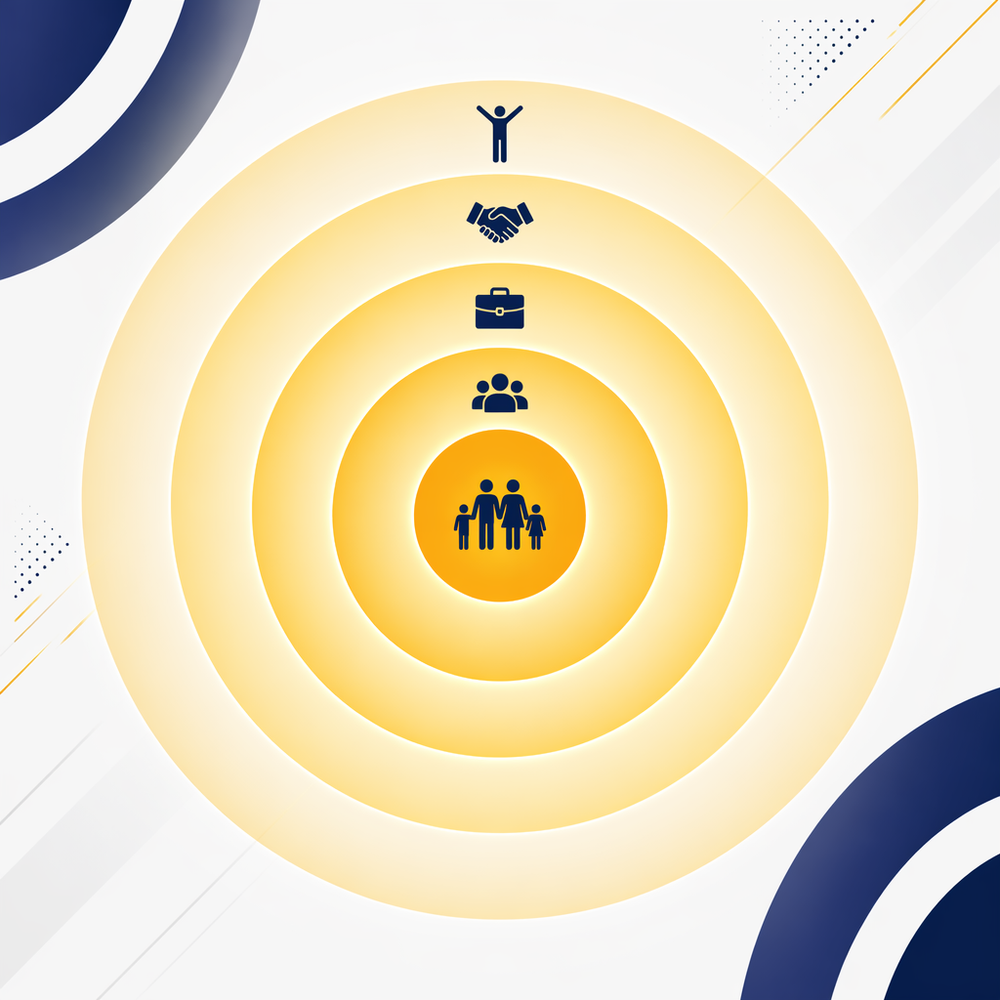

<!-- _class: title -->

# 从等排期到自己搞定

## AI超级个体实战工作坊 | 2小时沉浸式体验

SuperME · AI认知赋能

---

<!-- _class: key-takeaway -->

# 核心理念

> "不是AI厉害，是会用AI的人厉害。希望我们每个人都是那个人。"
>
> —— 布斯

今天的课程将带你从"等排期"走向"自己搞定"——这不需要你会写代码。

---

<!-- _class: agenda -->

# 课程导航

1. **第一幕 · 我的故事** — 从被裁到超级个体的认知转变 *20min*
2. **第二幕 · 工具地图** — 零代码运营的四级工具路线图 *15min*
3. **第三幕 · 8小时做产品** — 从零到完整产品的实战拆解 *30min*
4. **第四幕 · 五个真实变化** — AI如何改变工作与生活 *15min*

**学习目标**：找到你的第一个AI应用场景，并当场动手实践

---

<!-- _class: data-callout -->

# 这堂课的价值

| 10x | 95% | ¥800 | 8h |
|-----|-----|------|-----|
| 学员平均效率提升 | PRD AI完成率 | 建站总成本 | 零代码建站时间 |

---

# 课前热身：AIBTI 性格测试

扫码参与 → 看看你是哪种 AI 人格？

这个测试网站本身，就是布斯用 AI **8小时从零搭建**的

- 零代码
- 零设计基础
- 全程自然语言对话

**你正在体验的产品，就是今天要教你们做的事**

---

# 90%的运营人还在用"等排期"解决问题

请举手：

1. **装了AI工具但不知道干什么的？**
2. **觉得AI是技术人员的事、跟自己没关系的？**
3. **曾经因为等开发排期而抓狂的？**

今天这堂课，就是要把第三个问题的答案

从 **"等排期"** → 变成 → **"自己搞定"**

---

<!-- _class: section-break -->

# 第一幕
## 我的故事

---

# 13年阿里运营的三次身份重塑

| 标签 | 内容 |
|------|------|
| **服务者** | 13年阿里运营，从客服到商家运营，核心能力是"解决问题" |
| **经历者** | 2022年被裁、小公司3年、二进阿里 |
| **实践者** | 从装工具不会用，到8小时做出产品 |

---

<!-- _class: key-takeaway -->

# 被裁的冲击

> "动态里面95%的是开发产品，就我一个运营。他们认为不需要运营了。"

8个月没收入，十几万积蓄耗尽。再回阿里时心态完全不同了——

> "心态平和了很多，没有了那么多的不甘。"

**转折点：痛苦让我放下了身份执着，开始真正关注"解决问题"本身。**

---

# 一次25元的理发，触发了AI应用的第一个产品

**困境**：三月份装好AI，整整一周不知道怎么用

> "非常迷茫。不知道干嘛。"

**转折**：去理发店，突然想到——

> "哥们儿，你能不能把我近半年的理发记录调出来？"

---

# AI不只回答问题——它分析、规划、并自动执行

### 第一重：数据分析
> "你的平均理发周期是25天，每次花费35元"

### 第二重：主动规划
> "接下来我将为你制定近半年的理发计划"

### 第三重：自动执行
> "噔噔噔，iPhone上就出来了6条提醒！"

**AI不只是回答问题，它能采取行动！**

---

<!-- _class: key-takeaway -->

# 关键教训

> "这是我的第一个用AI实现的产品。我至今都对这个场景有感情。"

**AI应用不需要宏大场景。从身边最小的问题开始。**

---

# 改变一个习惯就够了：遇事先问AI

> "遇到任何事情想解决的时候，有没有想到**第一时间问AI**？就这么简单。"

| 旧模式 | 新模式 |
|--------|--------|
| "这事儿该问谁？" | **先问AI** |
| "百度一下" | **先问AI** |
| "我不会 / 太难了" | **先问AI** |
| "等开发排期" | **自己搞定** |

---

# 阿里之外，无数人已经在用AI创业

带女儿去梦想小镇玩，偶然看到一屋子人在听分享：

> "好多00后，有人说我是大四还没毕业的CEO……好多人直接支付500块钱的内测权益。"

一个开发同事说了一句话：

> "我作为一个开发，已经好久没写代码了。"

**如果开发都不写代码了，运营是不是也可以进去掺和一脚？答案是：YES！**

---

# 工具会被替代，但认知升级后的人不会

| 旧认知 | 新认知 |
|--------|--------|
| "我不会写代码" | "AI帮我写代码" |
| "等开发排期" | "自己搞定" |
| "没有场景" | "遇事先问AI" |
| "害怕被取代" | "用AI变成超级个体" |

---

<!-- _class: section-break -->

# 第二幕
## 工具地图

---

# 零代码运营的四级工具路线图

| 阶段 | 工具 | 一句话定位 |
|------|------|----------|
| 入门 | 豆包 / DeepSeek | 手机上随时问，零门槛 |
| 进阶 | Idea Cloud / 通义 | 网页版，接企业内部数据 |
| 实战 | CodeWork / Wukong | 桌面应用，能操作你的电脑 |
| 高阶 | Claude Code | 终端界面，最强推理能力 |

> "先用一个，用起来再说。**先有量，再有质。**"

---

# 实操环节：问AI一个问题

### 当场实操（3分钟）

1. 打开手机上任意AI应用
2. 想一个**今天遇到的具体问题**
3. 直接问AI，不需要"prompt技巧"
4. 3分钟后分享

**再小的问题都可以问。理发店都行。**

---

<!-- _class: section-break -->

# 第三幕
## 8小时从零做产品

---

# AIBTI 网站搭建全过程

| 时间 | 做了什么 | 认知突破 |
|------|---------|---------|
| 第1h | 让AI生成15个AI性格类型 | "我只需说想法" |
| 第2h | 用文生图生成角色头像 | "我不会设计，但AI会" |
| 第3h | 生成HTML页面 | "我不会写代码，但AI会" |
| 第4h | 部署到GitHub | "不需要服务器！" |
| 第5h | 添加数据看板 | "不需要数据库！" |
| 第6h | 调试和修Bug | "截图给AI就行" |
| 第7h | 优化体验 | "用户反馈=下轮prompt" |
| 第8h | 上线分享 | "我做出了完整产品" |

---

<!-- _class: data-callout -->

# 8小时、0行代码、800元 = 一个完整的线上产品

| 8小时 | 0行 | 800元 | 完整产品 |
|-------|-----|-------|---------|
| 总开发时间 | 手写代码 | 总成本(200M tokens) | 有数据、有交互、有看板 |

---

# AI是你的"数字员工"：商家群聊分析案例

**痛点1：被客户骂**
→ AI每天自动分析40个商家群聊，提取问题和风险

**痛点2：催开发排期**
→ AI自动质检（回复准确率 + 响应时间）

> "我不需要运营同学告诉我今天发生了什么——我已经分析完了。"

---

<!-- _class: section-break -->

# 第四幕
## 五个真实变化

---

# AI改变的不只是效率，而是人生的五个维度

| 维度 | 变化 |
|------|------|
| **家庭关系** | 用AI分析女儿错题。"女儿说，爸爸你脾气好了" |
| **社交圈** | 从部门小圈子到跨BU的AI社群 |
| **职场身份** | 从"等排期的运营"到"各BU抢着邀请的AI布道者" |
| **客户价值** | 商家用AI做竞品监控，"包装成工具至少值1万" |
| **人生状态** | "AI点燃了我的青春，又回到了刚入职的感觉" |

---

# 实操环节：用AI生成你的"第一个产品"

### 选择一个模板（10分钟）

**A. 个人效率**
让AI分析你的日程，给出时间管理建议

**B. 工作提效**
让AI帮你写本周最难写的邮件/汇报

**C. 创意产品**
让AI生成一个你想做但不知道怎么做的小工具方案

---

<!-- _class: section-break -->

# 收尾
## 三条行动建议

---

# 今天开始的三个行动

### 今晚回去做一件事
用AI解决一个明天工作中的具体问题

### 本周养成一个习惯
遇事先问AI（第一性思维）

### 一个月后的目标
用AI完成一个以前需要"等排期"才能做的事

---

<!-- _class: closing -->

# 开启你的超级个体之旅

## 从等排期到自己搞定，不是技术问题，是认知问题

预约1对1场景咨询 · 获取课件 + AI工具安装指南

**www.superme.ai | 联系我们获取企业定制方案**

---

<!-- _class: key-takeaway -->

# 结语

> "不是AI厉害，是会用AI的人厉害。而你，已经是那个人了。"
>
> —— 布斯 · SuperME AI认知赋能
