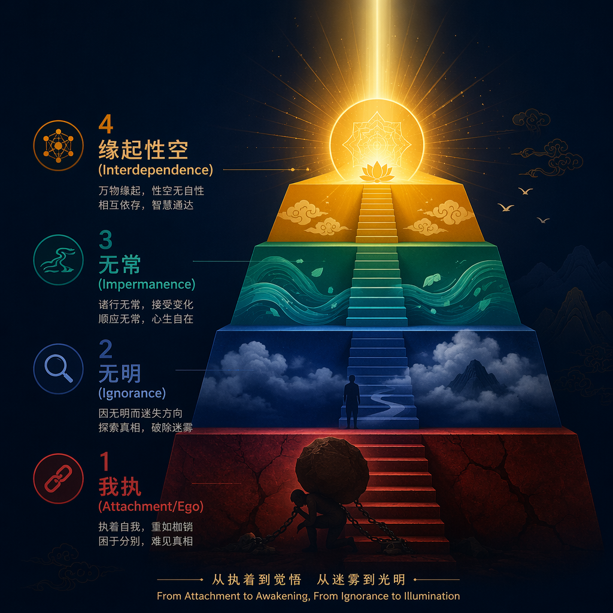
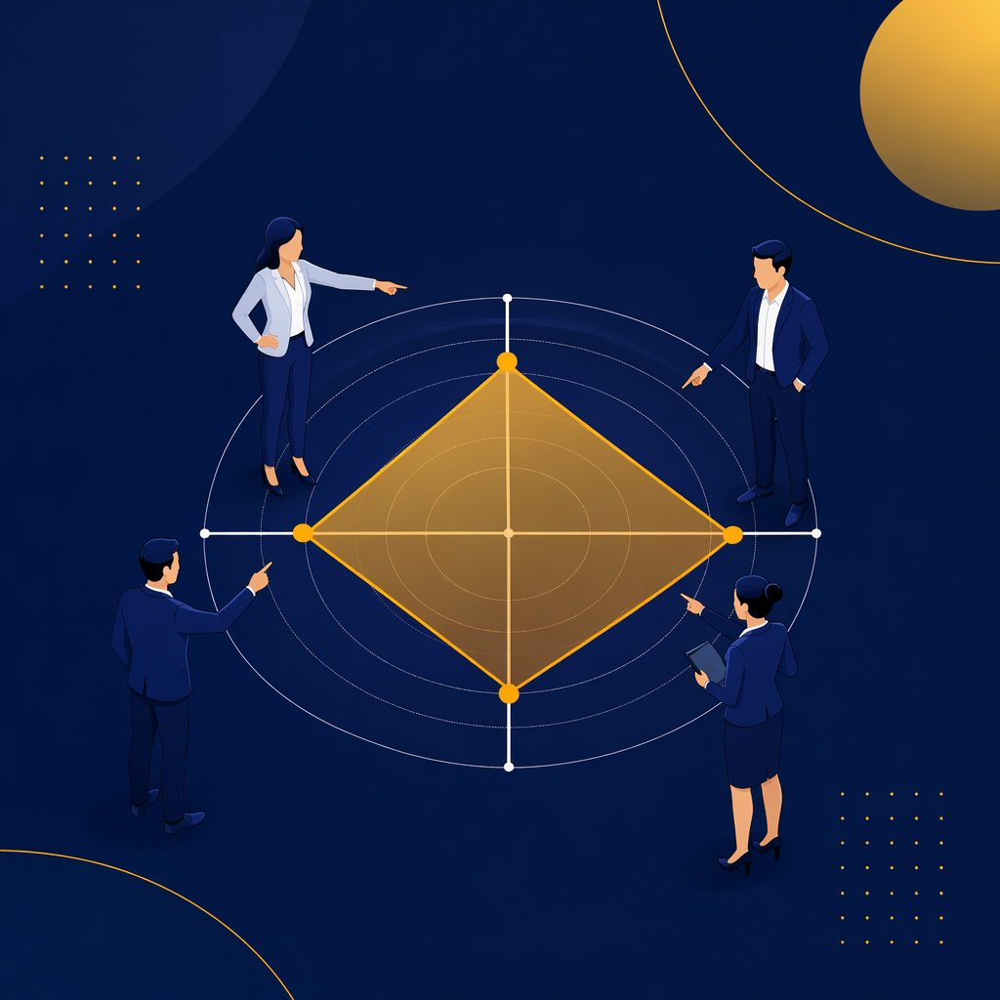
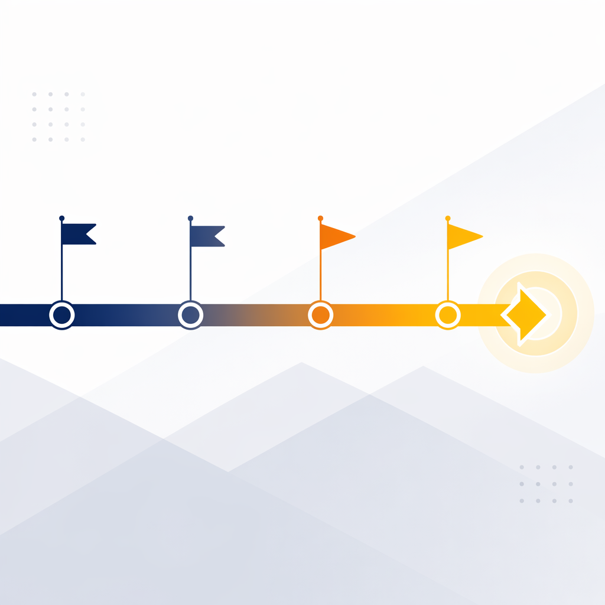

<!-- _class: title -->

# 认知四层跃迁模型

## 企业AI转型的底层操作系统

SuperME 超级个体方法论 · 企业内训

---

<!-- _class: key-takeaway -->

# 核心理念

> "必须接受被AI取代，才可能把AI用好。"
>
> —— 布斯

---

<!-- _class: agenda -->

# 课程导航

1. **为什么AI培训经常失败** — 企业AI转型的真正障碍不是工具 *15min*
2. **第一层：我执** — 经验主义是AI转型最大的隐性成本 *20min*
3. **第二层：无明** — 你不知道自己不知道什么 *20min*
4. **第三层：无常** — 拥抱不确定性是唯一的确定策略 *20min*
5. **第四层：缘起性空** — AI成为思维的自然延伸 *15min*
6. **松弛实验 + 行动计划** — 从认知到行动的落地路径 *30min*

---

# 72%的AI培训投入未产生可衡量回报——问题不在工具

**企业AI培训的典型路径**：

花钱买工具 → 安排培训 → 学员学会操作 → 回到工位不用 → 3个月后遗忘

### 真正的障碍是认知

- "我这个年纪学还来得及吗？"
- "万一AI出错了谁负责？"
- "我的岗位会不会被取代？"
- "公司给了每天1万块token，但我们不知道怎么用"

---

# 企业AI转型的底层操作系统：认知四层模型

| 层级 | 名称 | 核心 | 状态 |
|------|------|------|------|
| 04 | **缘起性空** | AI成为思维的自然延伸 | 目标 |
| 03 | **无常** | 接受不确定性 | 进阶 |
| 02 | **无明** | 知道自己不知道什么 | 觉醒 |
| 01 | **我执** | 执着于结果/身份/恐惧 | 起点 |

> "每往前走一步，不是一只眼变两只眼，是从**2D一下变成3D**了。"

---

<!-- _class: section-break -->

# 第一层：我执
## 经验主义是AI转型最大的隐性成本

---

# 第一层障碍：经验主义是AI转型最大的隐性成本

> "我特别想成功，是我执。我压力大，是我执。你特别不想要，也是我执。"

**我执 = 过度绑定的自我意识**

不管是"我一定要学会AI"还是"我害怕被AI取代"，核心都是 **"我"**

---

# 企业中的五种"我执"模式

| 我执表现 | 内心独白 | 后果 |
|---------|---------|------|
| 执着于效率 | "用AI必须提效50%" | 不立竿见影就放弃 |
| 执着于完美 | "prompt一定要写对" | 迟迟不敢动手 |
| 执着于身份 | "我是资深XX，不需要AI" | 错过整个时代 |
| 执着于安全 | "万一数据泄露怎么办" | 把AI当敌人 |
| 执着于确定性 | "AI回答不稳定" | 用传统软件标准要求AI |

---

# 布斯的我执：13年阿里人身份的崩塌

**2022年被裁** — 一夜之间失去身份

> "95%是开发产品，就我一个运营。他们认为不需要运营了。"
>
> "我觉得一个努力的阿里人，最终的结果就是被裁员。"

8个月没收入，十几万积蓄耗尽

**这就是我执的顶点** — 执着于身份、安全感、被认可

---

# 互动：自我诊断

在纸上写下（不需要分享）：

### "关于AI，我最担心的一件事是______"

写完后想一想：
**这个担心，是不是一种"我执"？**

觉察，就是第一步。

---

<!-- _class: section-break -->

# 第二层：无明
## 你不知道自己不知道什么

---

# 第二层障碍：你不知道自己不知道什么

> "很多人能看到别人身上的痛苦，但看不到自己。越是自己越看不清楚。"

**无明 ≠ 愚蠢**

无明 = **不知道自己不知道**

---

# 企业中的"集体无明"

| 典型表现 | 真相 |
|---------|------|
| "我们行业用不上AI" | 同行已经在用了 |
| "公司给了1万块/天token，不知道怎么用" | 工具到位了，认知没到位 |
| "等公司培训完再说" | 最好的培训是自己上手试 |
| "AI就是聊天工具吧" | 它能操作电脑、连接日历、分析数据 |

---

# 大公司的舒适区是最大的无明

### 梦想小镇冲击

> "00后大学生在做AI创业，好多人直接支付500块内测权益。"
>
> "我说 Open Cloud 已经这么火了吗？"

布斯在阿里有最先进的技术、最顶级的同事——却不知道外面的年轻人已经在用AI赚钱了

---

# 无明的打破来自一个微小的好奇心

### 装了工具不知道怎么用

> "三月份装好AI之后，非常迷茫。不知道干嘛。"

### 组织层面的集体无明

> "公司给了大家每天2亿token，大概1万元。但我们不知道怎么用，没用起来。"

**觉醒时刻**：去理发店，突然想到"能不能帮我分析一下理发记录？"

---

# 互动：盲区发现

分组讨论（3-4人，5分钟）：

### "在AI方面，你的团队/部门可能存在哪些'不知道自己不知道'的事情？"

每组产出**一条最大的"盲区假设"**

写在便签纸上贴到白板

---

<!-- _class: section-break -->

# 第三层：无常
## 拥抱不确定性是唯一的确定策略

---

# 第三层跨越：拥抱不确定性是唯一的确定策略

> "AI不是代码，不是一个确定性的结果。所以我们就试验它的边界就可以了。"

> "接受一切的发生，也不纠结于这个事情为什么会发生。走到这个时候，很多现代人的焦虑就消解了。"

---

# 从确定性思维到不确定性思维

| 旧思维（确定性） | 新思维（无常） |
|----------------|--------------|
| AI必须给出正确答案 | AI给参考，我来判断 |
| 一次没成功 = 工具不行 | 多试几次，探索边界 |
| 今晚解决不了就焦虑 | **"明天一定可以"** |
| 想清楚再动手 | 先用起来，边用边学 |
| 追求100分的prompt | **"先有量，再有质"** |

---

# "不内耗"的飞轮效应

> "我无所谓。我今天碰到再困难的问题，我明天早上可以解决。这是一个很大的自信。"

> "做着做着好像感觉每天就是把事情做到位，那个结果就会自然发生。"

**不内耗 ≠ 不在乎**

不内耗 = **信任过程**

---

<!-- _class: section-break -->

# 第四层：缘起性空
## AI成为思维的自然延伸

---

# 第四层境界：AI成为思维的自然延伸

不再区分"用AI"和"不用AI"——AI就是思考的一部分

> "不要 Human Doing，要 Human Being。让我们成为一个人，然后成为真正的自己。"

---

# 松弛：高阶的信任状态

> "跟这些顶级AI聊天，你反而是一个很松弛的状态。我怕什么？路由器密码给你，全部都给你。反而把你优化得特别好。"

> "人人都是开发者。现在95%的代码都是大模型写的，我们管他什么技术栈呢？"

> "你想做一件事情是你的事情。别人怎么看待，是别人的事情。"

---

# 我执 vs 松弛：两种工作状态的对照

| 我执状态 | 松弛状态 |
|---------|---------|
| "AI会不会泄露隐私" | "密码都给你，帮我优化" |
| "prompt一定要写对" | "多试几次，看看边界" |
| "一定要做出成果" | "玩起来，享受过程" |
| "晚上想不通就焦虑" | "明天早上一定可以" |
| "必须学会才能用" | "先用起来，边用边学" |

---

<!-- _class: section-break -->

# 从认知到行动
## 松弛实验

---

# 核心互动：松弛 vs 我执 对照实验

全场分为两组，用同一个AI解决同一个问题：

### A组（我执状态）
- 必须用标准prompt格式
- 只能问一次
- 答案必须100%准确
- 不能给真实数据

### B组（松弛状态）
- 随便怎么问
- 可以反复追问
- 有启发就行
- 大胆给真实场景

**10分钟后对比结果**

---

<!-- _class: key-takeaway -->

# 实验结论

> "越放下防备，AI越能帮到你"

B组（松弛状态）几乎总是产出更好的结果，**而且过程更愉快**。

这就是**松弛**的力量——不是懈怠，是高阶的信任状态。

---

# 制定你的认知跃迁计划

### Step 1：觉察我执（3分钟）
我在AI学习中最大的执念是______

### Step 2：识别无明（3分钟）
我可能"不知道自己不知道"的领域是______

### Step 3：拥抱无常（3分钟）
我承诺一个"先用起来"的行动______

### Step 4：走向松弛（3分钟）
我的"心流时间"是每天/每周______

---

# 从"要你学"到"我要学"：管理者的五个赋能动作

| 我执式管理 | 松弛式赋能 |
|-----------|-----------|
| 强制全员培训 | 先找10个"自燃型"种子用户 |
| KPI考核使用率 | 分享会展示真实成果 |
| 统一工具和流程 | 让员工自选工具，先用起来 |
| 要求立刻产出ROI | 给3个月探索期 |
| 一次集中培训 | 建立持续的社群，以交代学 |

> "形成'要让我学'改为'**我要学**'的转变。"

---

# 90天认知转型路线图

| 阶段 | 时间 | 目标 | 关键动作 |
|------|------|------|---------|
| **觉醒期** | 第1-2周 | 突破我执 | 每人完成1个AI小实验 |
| **探索期** | 第3-4周 | 走出无明 | 每周分享会，发现新场景 |
| **应用期** | 第5-8周 | 拥抱无常 | 3个真实业务场景落地 |
| **融合期** | 第9-12周 | 走向松弛 | AI成为工作流的自然部分 |

---

# 五步行动建议

1. **觉察我执** — 问自己：我到底在执着什么？
2. **接受不确定** — AI不是确定性系统，试验它的边界
3. **找到心流时间** — 每天30分钟纯粹"玩AI"
4. **先有量再有质** — 不要等想清楚再开始
5. **找到同路人** — 最好的学习就是分享

---

<!-- _class: closing -->

# 从我执到松弛，不是修炼几年的漫长过程

## 它可以发生在一个瞬间

当你放下"我一定要学会"的执念，打开AI，随便问一个你好奇的问题

---

<!-- _class: key-takeaway -->

# 结语

> "好奇心就是松弛状态下的自然表达。"
>
> —— 布斯 · SuperME 超级个体方法论
