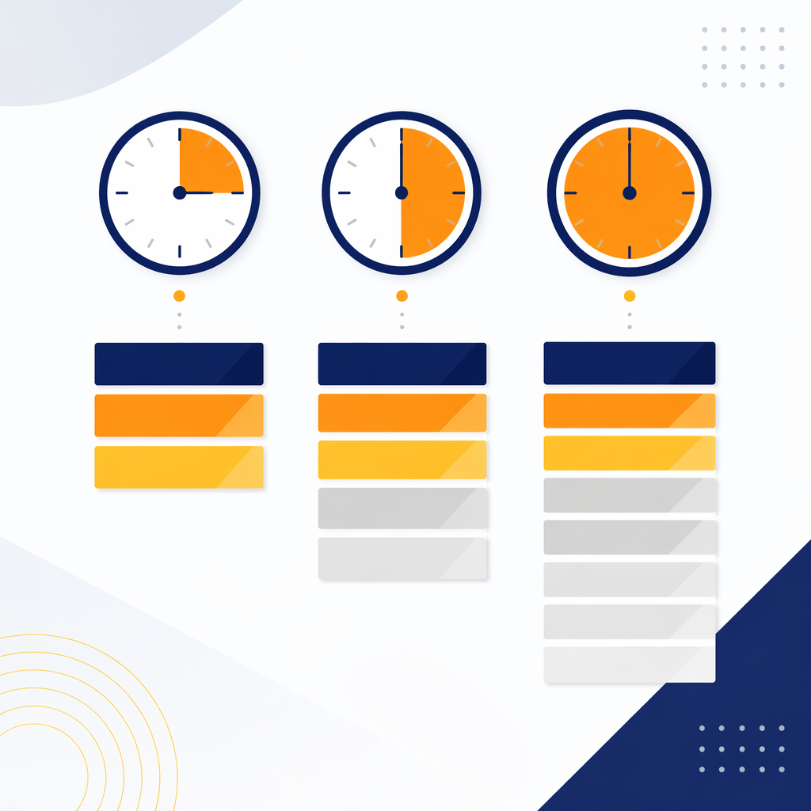
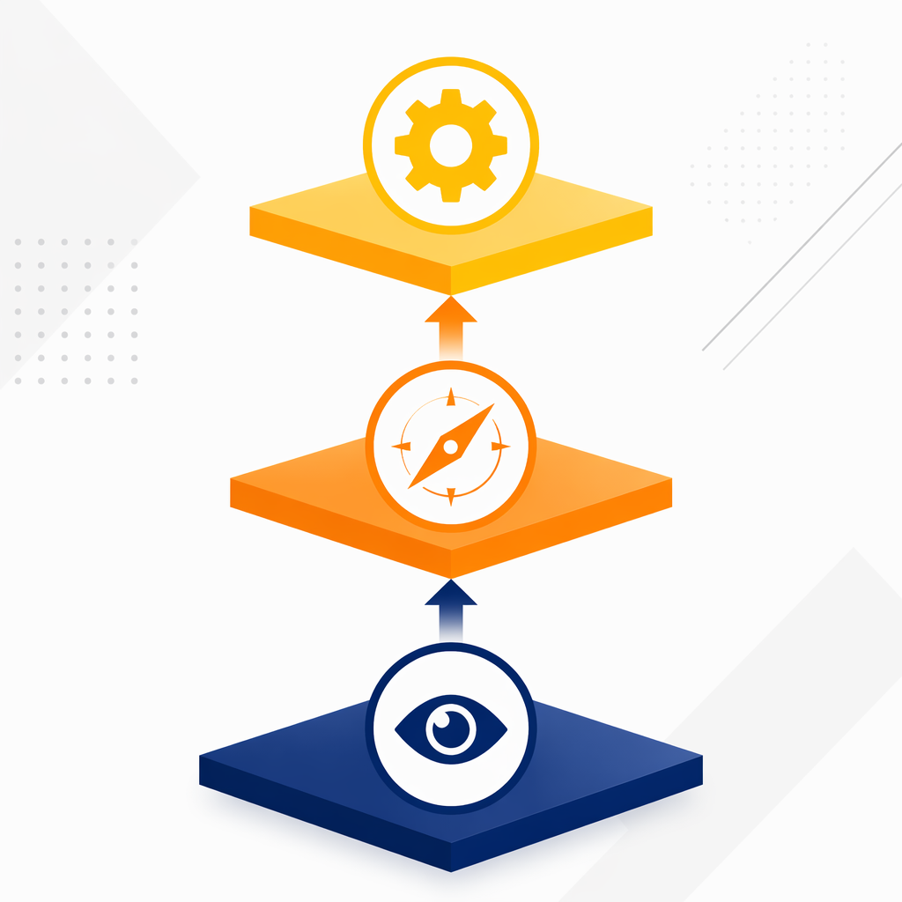

<!-- _class: title -->

# 理发店顿悟

## AI场景发现的标准化教学案例 | 体验课

SuperME · AI认知赋能

---

<!-- _class: key-takeaway -->

# 核心理念

> "这是我的第一个用AI实现的产品。我至今都对这个场景有感情。"
>
> —— 布斯

---

# 案例概要

| 维度 | 内容 |
|------|------|
| **主人公** | 布斯，13年阿里运营，零编码经验 |
| **核心矛盾** | 装了AI工具，但不知道用来做什么 |
| **突破时刻** | 在理发店随口问了一句话 |
| **关键教训** | AI应用不需要宏大场景，从身边最小的问题开始 |
| **教学目标** | 帮你突破"不知道用AI做什么"的认知障碍 |

---

<!-- _class: agenda -->

# 案例使用指南

1. **Act 1 · 困境** — 工具装好了，认知没准备好 *5min*
2. **Act 2 · 转折** — 一次普通的理发，一个不普通的洞察 *5min*
3. **Act 3 · 震撼** — AI的三重能力：分析→规划→执行 *10min*
4. **教学启示** — 四个可迁移的关键教训 *10min*

| 授课格式 | 时长 | 重点 |
|---------|------|------|
| 闪电演讲 | 15min | Act 1-3 + 核心教训 |
| 标准授课 | 30min | 全部内容 + 1次讨论 |
| 深度工作坊 | 60min | 全部内容 + 实操 + 分享 |

---

<!-- _class: section-break -->

# Act 1
## 困境

---

# 工具装好了，认知没准备好——一种普遍的AI焦虑

2026年3月，布斯在老板要求下安装了AI工具

> "三月份装好AI之后，我不知道怎么用，**非常迷茫**。不知道干嘛。"

身边的同事也一样：

> "你买了Mac Mini了吗？你装了什么MCP？你安装了什么Skill？"

大家比拼的是**装备**，不是**使用**

---

# 每天浪费1万元AI算力的集体无明

> "我们卷了半天之后，也不知道它能用来做什么。工具装上了，但是不知道它能干什么。"

公司给了每位员工每天 **价值1万元** 的AI算力额度

**每天都在浪费**

> 问：你有过这样的经历吗？

---

<!-- _class: section-break -->

# Act 2
## 转折

---

# 一次普通的理发，一个不普通的洞察

一周后，布斯去理发

- 咸宁老街旁边的社区理发店
- 理了三年的熟悉师傅
- 一次普通得不能再普通的理发

坐在椅子上，他突然冒出一个念头——

---

<!-- _class: quote -->

> "哥们儿，你能不能把我近半年的理发记录给我调出来？"

理发师一脸困惑："你干什么？"

> "哥，我拍个照片。反正我又不是查账。"

---

# 没有精心设计的prompt，只有一张模糊的照片

布斯拍了理发消费记录的照片

发给AI

就说了一句：**"帮我分析一下"**

没有精心设计的prompt

没有专业的数据格式

就是一张手机拍的模糊照片

---

<!-- _class: section-break -->

# Act 3
## 震撼

---

# AI的第一重回应：数据分析

> "布斯，你的平均理发周期是 **25天**，平均每次花费 **35元**。"

布斯心想：嗯，挺准的

但这我自己算也能算出来……

---

# AI的第二重回应：主动规划

> "接下来我将为你制定**近半年的理发计划**。"

等等……我没让你做这个

AI **主动** 延伸了任务

从"分析过去"到"规划未来"

---

# AI的第三重回应：自动执行

> "你将在你的 iPhone 提醒中，在以下日期收到理发提醒。"

然后——

> "**噔噔噔**，iPhone上就出来了6条提醒！"

每隔25天一条，未来半年的理发日程

**全部自动设置好了**

---

# AI不只回答问题——它分析、规划、并自动执行

| 层级 | AI做了什么 | 超出预期？ |
|------|-----------|-----------|
| 第一重 | **分析** — 提取数据规律 | 预期内 |
| 第二重 | **规划** — 主动制定计划 | 超出预期 |
| 第三重 | **执行** — 自动创建日历提醒 | 震撼 |

大多数人对AI的认知停留在**第一重**

理发店案例展示了AI的完整能力链：**分析 → 规划 → 执行**

---

# 三重能力模型详解

### 分析层（数据洞察）
AI从非结构化数据中提取模式和规律

### 规划层（主动决策）
AI基于分析结果主动延伸任务，制定可执行方案

### 执行层（自动行动）
AI直接操作系统（日历、邮件、应用），将计划变为现实

**从被动工具 → 主动助手 → 自动执行者**

---

<!-- _class: key-takeaway -->

# 关键时刻

> "它不光帮你做了数据的分析，还帮你做了提醒任务的创建。"
>
> "这是我的第一个用AI实现的产品。**我至今都对这个场景有感情。**"

---

<!-- _class: section-break -->

# 教学启示
## 四个可迁移的关键教训

---

# 教训1：不需要宏大场景

> "这个场景已经非常小众了，非常小了。"

但它是布斯的**突破时刻**

| 常见误区 | 正确姿态 |
|----------|----------|
| "我要用AI做一个大项目" | 从理发记录开始 |
| "等找到完美场景再用" | 随便问一个问题就是开始 |
| "这种小事不值得用AI" | 再小的事都值得试 |

---

# 教训2：关键不是技术，是"想到问它"

> "遇到任何事情想解决的时候，有没有想到第一时间问AI？就这么简单。"

布斯把这叫做 **第一性思维**

| 以前 | 以后 |
|------|------|
| 遇到问题 → 问同事 | 遇到问题 → **先问AI** |
| 不知道怎么做 → 搜百度 | 不知道怎么做 → **先问AI** |
| 觉得太难 → 放弃 | 觉得太难 → **先问AI** |

---

# 教训3：AI不只是问答，它能行动

理发店案例的核心震撼不是数据分析

而是AI **主动采取了行动** — 创建了日历提醒

> "就像在绿城App里创建了一个工单。这个工单不是人创建的，而是机器人帮你创建的。你说了一句话，它就帮你创建了。"

---

# 好奇心比prompt技巧更重要

布斯没有用任何"prompt技巧"

他只是**好奇** — "我的理发周期到底是多久？"

> "好奇心就是松弛状态下的自然表达。"

不需要学习"prompt工程"

只需要保持**对世界的好奇心**

---

<!-- _class: section-break -->

# 你的理发店在哪里？
## 现场实操

---

# 找到你的"理发店时刻"

### 现在就做（5分钟）：

1. 拿出手机，打开任意AI应用
2. 拍一张**你身边任何东西**的照片
   - 桌上的咖啡收据？
   - 手边的快递单？
   - 今天的会议纪要？
3. 发给AI，问一个你**真正好奇**的问题
4. 看看AI会给你什么惊喜

**不要想"什么才值得问"——随便问就对了**

---

# 分享时刻

谁愿意分享：

- 你问了AI什么？
- AI给了你什么意想不到的回答？
- 这个体验，跟你之前对AI的印象有什么不同？

---

# 理发计划→错题分析→建站→品牌：三个月的能力跃迁路径

| 时间 | 里程碑 |
|------|--------|
| 第1周 | 理发计划 — 第一个AI产品 |
| 第2周 | 女儿错题分析 — 拍照问AI推广到教育 |
| 第3周 | 商家群聊分析 — 应用到工作场景 |
| 第4周 | 8小时建站 — "我有想法、AI来执行" |
| 第2月 | 全公司分享 — 从使用者到布道者 |
| 第3月 | SuperME品牌 — 从实践到方法论 |

**每一步的底层逻辑，都是理发店种下的种子**

---

# 延伸案例：女儿的错题本

**场景**：辅导作业总是吵架

**做法**：
- 拍了作业帮的错题照片
- AI分析错误模式
- 生成1页根因分析 + 60道练习题

**结果**：

> "女儿说，爸爸你的脾气有点好了，愿意跟我一起玩了。"

**AI改善的不只是效率，还有关系**

---

# 延伸案例：女儿的转学简历

**场景**：女儿转学需要简历，不知道小学生简历怎么写

**做法**：
- 把1-3年级成绩单照片喂给AI
- AI生成HTML网页版简历
- 保存为PDF

**结果**：10分钟搞定

> 老婆震惊，要求也装一个AI

---

# 总结：遇事先问AI的第一性思维

| 旧模式 | 新模式 |
|--------|--------|
| 问人 — "该问谁？" | **先问AI** |
| 搜索 — "百度一下" | **先问AI，再决定下一步** |
| 放弃 — "太难了" | **任何事，第一时间问AI** |

---

<!-- _class: closing -->

# 你的"理发店时刻"可能就在今天

## 打开AI，随便问一个你好奇的问题，那就是你的第一步

了解完整课程体系 · 预约企业内训 · 获取商业授权

**www.superme.ai**

---

<!-- _class: key-takeaway -->

# 结语

> "AI应用的门槛不是技术，是'想到问它'。"
>
> —— 布斯 · SuperME AI认知赋能
